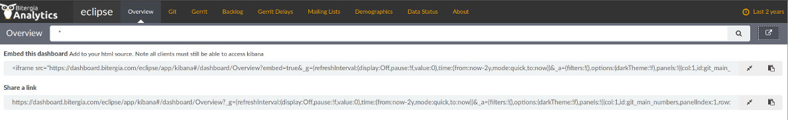

# Sharing or embedding your project metrics

Since GrimoireLab uses [Kibana](https://www.elastic.co/products/kibana) for visualization, you can use [its sharing and embedding features](https://www.elastic.co/guide/en/kibana/current/dashboard.html#sharing-dashboards)

## How to share your GrimoireLab dashboard

To share a dashboard, click the `Share` button  to display the Sharing panel.

